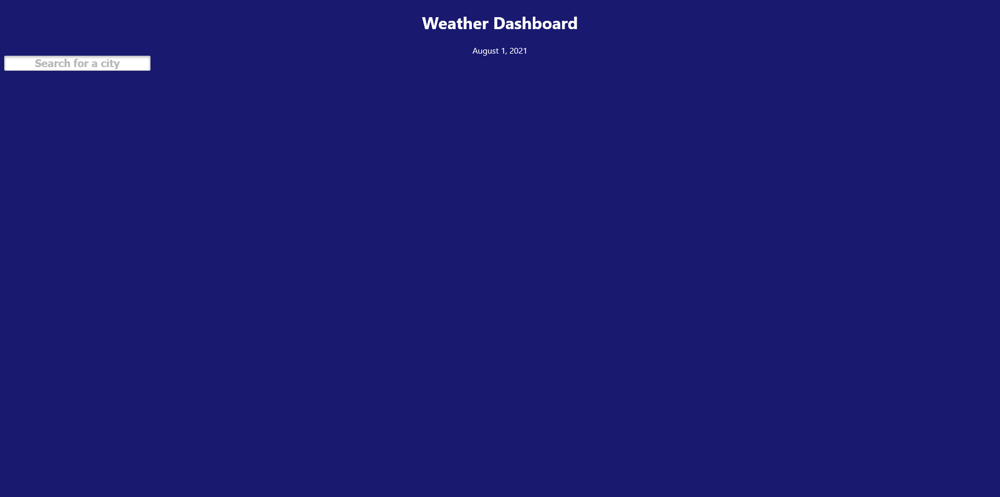
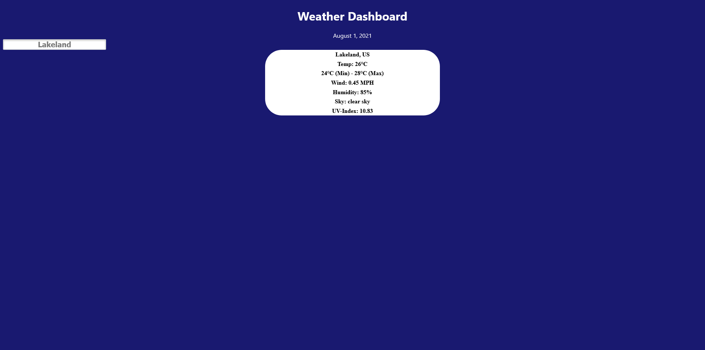

# Weather Dash

## Description
This is a weather dashboard. The current date is always displayed when the page is loaded. Type in ANY city in the input field (works with any keypress!) and you are presented with weather details such as temperature, wind speeds, humidity and UV index.

## Web Link
[Take a look at the weather!](https://lightfooted.github.io/weather-dashboard/)

## Screenshot

Blank fields

Weather data when searched

### Additional Notes
Missing search city history display and 5 day forecast.

## Construction
Completed by Kimberly Collazo